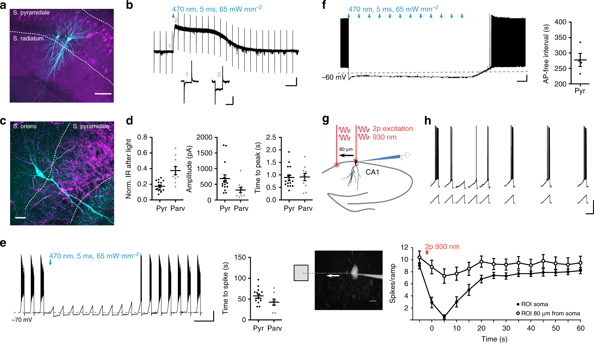

<!-- README.md is generated from README.Rmd. Please edit that file -->

# Rsdash

<!-- badges: start -->
<!-- badges: end -->

The goal of Rsdash is to talk with the smartfigure API, probably for
pushing the smartfigure on a website.

## Installation

<!--
You can install the released version of Rsdash from [CRAN](https://CRAN.R-project.org) with:

``` r
install.packages("Rsdash")
```
-->

You can install the development version from
[GitHub](https://github.com/) with:

``` r
# install.packages("devtools")
devtools::install_github("smartfigures-dar/R-sdash")
```

## Example

This is a basic example which shows you how to solve a common problem:

``` r
library(Rsdash)
## get public panels of group 5 (sfb1315 group members), add all authors information
Panels_gr5= getauthorlist(sdashpanels(5))
## plot the image and the list of authors surnames of first panel
i=1
sdashimage(Panels_gr5$id[i])
```



``` r
paste0(Panels_gr5$allauthors[[i]]$surname,collapse=", ")
#> [1] "Yinth Andrea, Rost, Pofahl, Fernandes, Kopton, Moser, Holtkamp, Masala, Beed, Tukker, Oldani, Bönigk, Kohl, Baier, Schneider-Warme, Hegemann, Beck, Seifert, Schmitz"
```

<!---
You'll still need to render `README.Rmd` regularly, to keep `README.md` up-to-date. `devtools::build_readme()` is handy for this. You could also use GitHub Actions to re-render `README.Rmd` every time you push. An example workflow can be found here: <https://github.com/r-lib/actions/tree/master/examples>.

You can also embed plots, for example:


In that case, don't forget to commit and push the resulting figure files, so they display on GitHub and CRAN.
--->
